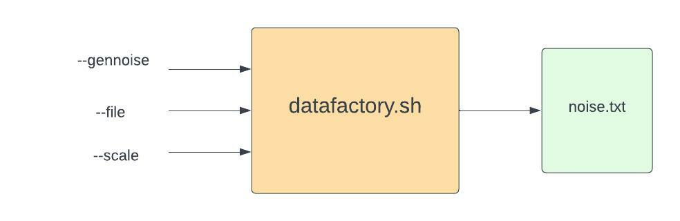

# Bash_Command_Tool
This is Qiheng's repo for IDS 706 project 2 Bash Command-Line Tool.

The command line tool we realized is called datafactory, which generates number of noise data that could be set in a specific scale and stores the result to a `.txt` file. We believe the noise data could be useful in the data preparation stage, as the noise data could later be utilized to test program robustness and abnormaly detection.
&nbsp;
## Project Structure

&nbsp;
## Usage
`./datafactory.sh --gennoise COUNT --file FILENAME(default: noise.txt) --scale SCALE(default: 1000)`
&nbsp;
## Example
```
// Generate 20 noise data that in scale [0, 100) and store the result to my_noise.txt
$ ./datafactory.sh --gennoise 20 --file my_noise.txt --scale 100
count: 20
processing my_noise.txt
count: 100
20 noises is generated in my_noise.txt

$ cat my_noise.txt
41
18
71
38
84
45
66
49
36
56
21
28
76
78
38
97
65
24
44
32
```
&nbsp;
## Hightlight
1. Add argument check and set shell script as strict mode to increase script robustness.

2. Usage guide would pop up when invalid beahavior is encountered.